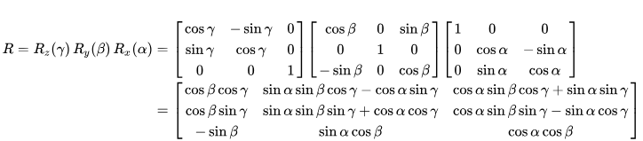

# TODO

## Renderer
&#9745; ~~Flat shader~~  
&#9745; ~~Fix cube index orientation~~  
&#9745; ~~Objects store rotation and position separately (to prevent rotation about origin)~~  
&#9745; ~~Debug mat4, local mats causing movement on rotation~~  
&#9744; TriFan for Objects  
&#9745; ~~Debug camera view matrix, moving z doesn't change scale~~  
&emsp; NOTE: clip space vertices now automatically divided by abs val of w component  
&emsp; NOTE: fixed issues with z direction, IN is NEGATIVE  
&#9744; switch to vertex normals  
&emsp; &#9744; ~~Modify Object class to handle vertex normals~~  
&emsp; &#9744; Modify Projector and shader to handle vertex normals or flat shading  
&emsp; &emsp; &#9744; ~~push the flat/smooth shading check outside of tri loop to be per object~~  
&emsp; &#9744; Compute the normal_transform multplication prior to save on double calculating  
&#9744; line renderer  
&#9744; Lights class  
&emsp; &#9744; Ambient  
&emsp; &#9744; Directional  
&emsp; &#9745; ~~Point~~  
&emsp; &#9744; Debug, something about Z location of lights seems off, almost as if the light is relative to the camera...  
&emsp; &#9744; Add specularity to all objects  
&emsp; &#9744; Add visualization of point lights  
&#9745; ~~add lights to Scenes and Scenebuilder~~  
&#9744; Z-ordering  
&#9744; Z-clipping based on near and far clip  
&#9744; Transparent elements  
&#9744; deferred rendering  
&emsp; &#9744; ~~GBuffer~~  
&emsp; &emsp; &#9744; Specular buffer  
&emsp; &emsp; &#9744; Optimize buffer to use memalloc and continuous memory  
&emsp; &emsp; &#9744; buffer should be 1D array, where each entry contains ALL data for that pixel  
&emsp; &#9744; deferred lighting with light volumes (see https://learnopengl.com/Advanced-Lighting/Deferred-Shading)  
&emsp; &#9744; triangle rasterizer  
&emsp; &#9744; Merge loop for tri rasterizer and tri projector  
&emsp; &#9744; ~~Fix pineda's, something about triFunction is off and normals are getting blown up~~  
&emsp; &#9744; Add perspective correct baricentric interpolation, at the moment hard to test because all things are flat colors  
&#9744; ray tracing    

## Utility  
&#9745; ~~SceneBuilder class~~  
&#9745; ~~rework projector to take in scenes~~  
&#9745; ~~Render statistics printout~~  
&emsp; &#9745; R~~enderer runtimes using clock()~~  
&#9745; ~~JSON loader for scenes~~  
&#9745; ~~Command handles json scenes as input~~  
&#9744; Add safeguards to prevent creation of cameras, objects, or lights in regions they shouldn't be allowed in json file  
&#9744; JSON saver for scenes  
&#9744; JSON loader for meshes/STL  
&#9744; Primitves (~~spheres~~, pyramids, etc.)  
&emsp; &#9745; ~~Cube~~  
&emsp; &#9745; ~~Icosphere (and icosahedron)~~  
&emsp; &emsp; &#9744; Fix Icosphere normals  
&emsp; &#9745; ~~Plane~~    
&#9745; ~~Rework Object Builder to auto convert scale float to vec~~  
&#9744; Update Projector render to function to use stored variables instead of new construction  
&#9744; Ability to cast vectors up and down dimensions  
&#9744; Add Translate, Scale, and Rotate to Object  
&#9744; Add RotateAxis to Objects  
&#9744; Optimize mat4::RotateEuler
  

## Integration
&#9745; ~~Refactor to new project~~  
&#9744; Rework scanline renderer for 3d  